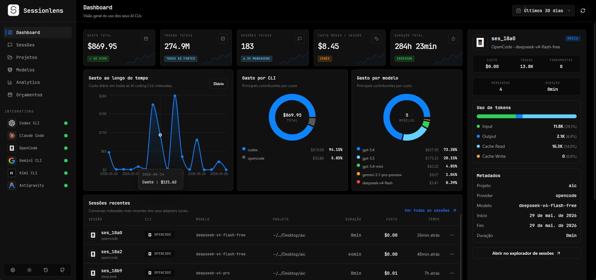
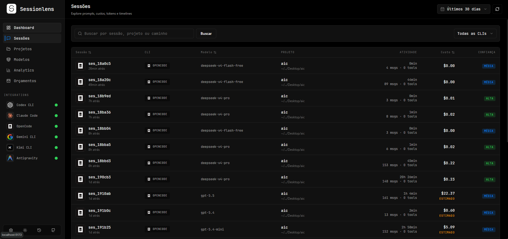
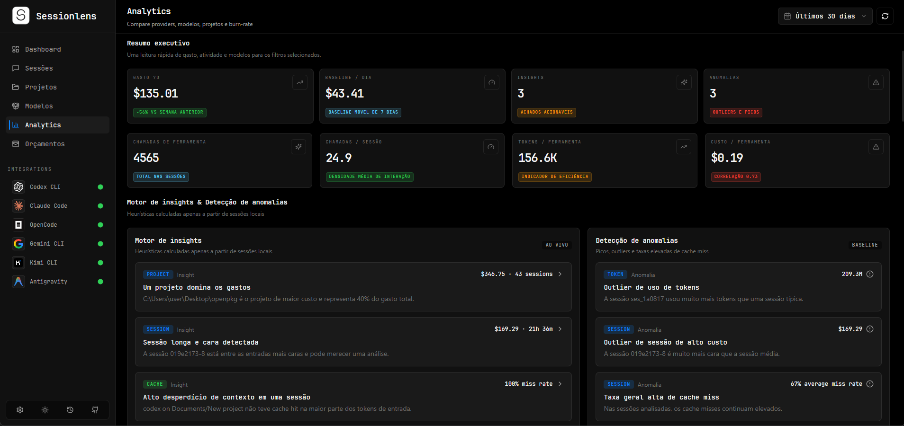
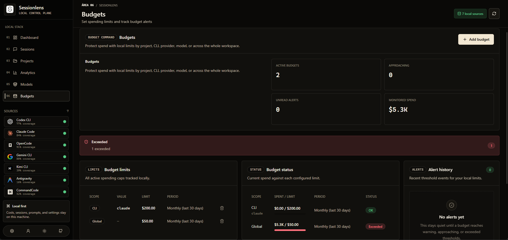

<div align="center">

<picture>
  <source media="(prefers-color-scheme: dark)" srcset="assets/logo/sessionlens-white-logo.png">
  <source media="(prefers-color-scheme: light)" srcset="assets/logo/sessionlens-black-logo.png">
  
</picture>

# Sessionlens

**Observabilidade local-first para AI Coding CLIs — multi-CLI, open-source, privado.**

[](LICENSE)
[](https://github.com/melloxyz/sessionlens/releases)
[](https://nodejs.org)
[](https://pnpm.io)
[](https://www.typescriptlang.org)

<p>
  <a href="README.md">English</a> · <strong>Português (BR)</strong>
</p>

_Rastreie custos, analise sessões e compare eficiência entre suas CLIs de IA — tudo offline, tudo local._

[Funcionalidades](#funcionalidades) · [Quick Start](#quick-start) · [Stack](#stack-tecnológica) · [Arquitetura](#arquitetura) · [Integrações](#integrações-suportadas) · [Changelog](CHANGELOG.md) · [Contribuindo](CONTRIBUTING.md)

<br/>

<table>
  <tr>
    <td align="center"><strong>Dashboard</strong><br/></td>
    <td align="center"><strong>Sessions</strong><br/></td>
  </tr>
  <tr>
    <td align="center"><strong>Analytics</strong><br/></td>
    <td align="center"><strong>Budgets</strong><br/></td>
  </tr>
</table>

</div>

---

## Funcionalidades

| Recurso | Descrição |
| --- | --- |
| **Multi-CLI** | 9 CLIs suportadas: Codex, Claude Code, OpenCode, Gemini CLI, Kimi, Aider, Qwen, Antigravity e CommandCode |
| **Rastreamento de custos** | Custo real da CLI, estimativa por tokens e sync com OpenRouter. Spend confirmado e estimado exibidos separadamente |
| **Sessões inteligentes** | Tokens (input/output/cache/reasoning), tool calls, duração, contexto do projeto, breakdown por modelo |
| **Analytics** | Dashboard com filtros contextuais, trends de gasto, breakdown por modelo/provider/projeto, páginas dedicadas de insights e anomalias |
| **Confiabilidade de dados** | Qualidade por campo, contadores de drift por adapter, tools capturadas, arquivos tocados e coverage por CLI em Settings e Session Detail |
| **Orçamentos** | Limites globais, por projeto, CLI, provider ou modelo com histórico de alertas locais |
| **Privacidade & segurança** | Redação opt-in de inputs sensíveis; CORS restrito ao localhost; sem detalhes de erro expostos; chamadas git sem shell injection |
| **Local-first** | SQLite via sql.js WASM — zero dados enviados externamente, zero telemetria, zero contas |
| **Auto-ingestão** | Filesystem watcher com debounce; checkpoints incrementais pulam arquivos não alterados automaticamente |
| **UI premium** | Design system próprio — DataPanel, DataTable, FigurePanel, CompactStat, ControlField, skeleton states e tooltips |
| **Temas** | Modo escuro e claro com contraste refinado, chart palette acessível e persistência via localStorage |
| **i18n** | Inglês e Português (PT-BR) com formatação localizada de datas, durações, moedas e labels de insights |
| **System Tray** | Ícone na bandeja do Windows com auto-start, ingestão rápida e contagem de sessões ao vivo |
| **Controles de projeto** | Ocultar/restaurar projetos sem deletar dados; abrir pasta; acompanhar timeline git e sessões relacionadas |

---

## Novidades na v0.9.4

> Histórico completo em [CHANGELOG.md](CHANGELOG.md).

- **Spend confirmado vs estimado** separados nos KPIs do Dashboard e Overview
- **Controles de privacidade:** redação opt-in de inputs sensíveis nas Configurações
- **Contadores de drift:** sinais de qualidade por adapter expostos em Settings
- **Ingestão incremental:** arquivos não alterados são pulados via checkpoints — re-scans mais rápidos
- **IDs de projeto estáveis:** upsert por path — IDs não mudam entre ingestões
- **Utilitários de adapter compartilhados:** ~200 linhas de duplicação removidas entre adapters
- **Segurança:** CORS restrito; git sem modo shell; sanitização de erros

---

## Quick Start

### Pré-requisitos

- [Node.js](https://nodejs.org) >= 20
- [pnpm](https://pnpm.io) (`npm install -g pnpm`)

### Instalação

```bash
git clone https://github.com/melloxyz/sessionlens.git
cd sessionlens
pnpm install
pnpm dev
```

Frontend: **http://localhost:5173** — API Backend: **http://127.0.0.1:3030**

### Comandos

| Comando | Descrição |
| --- | --- |
| `pnpm dev` | Stack completo (backend + frontend) |
| `pnpm build` | Build de produção |
| `pnpm typecheck` | Typecheck em todos os packages |
| `pnpm lint` | Lint em todos os packages |
| `pnpm -r test` | Executar suite de testes |
| `pnpm changelog` | Regenerar `CHANGELOG.md` via git-cliff |
| `pnpm --filter @sessionlens/backend diagnose:adapters` | Diagnóstico de adapters (capabilities, fontes, qualidade) |
| `pnpm --filter @sessionlens/backend backfill:quality` | Backfill idempotente de tools, files e data quality |

---

## Stack Tecnológica

| Camada | Tecnologia | Versão |
| --- | --- | --- |
| **Runtime** | Node.js | >= 20 |
| **Gerenciador** | pnpm | >= 9 |
| **Linguagem** | TypeScript | 5.9 |
| **Backend** | Fastify | 5.x |
| **Database** | SQLite via sql.js | WASM |
| **Frontend** | React + Vite | 18 / 6.x |
| **Estilo** | Tailwind CSS | v4 |
| **Gráficos** | Recharts | 2.x |
| **Ícones** | Lucide React | latest |
| **Pricing** | OpenRouter API | sync |
| **Tray** | trayicon | Windows |

---

## Arquitetura

```
sessionlens/
├── assets/
│   ├── logo/              # Logotipos preto e branco (theme-aware)
│   └── screenshots/       # Prints da interface
├── packages/
│   ├── backend/           # Fastify + sql.js + adapters + costing + tray
│   ├── frontend/          # React + Vite + Tailwind v4 + Recharts
│   └── shared/            # Tipos TypeScript compartilhados
├── scripts/               # Dev scripts (Windows-safe)
├── .github/workflows/     # CI + Release (git-cliff)
└── CHANGELOG.md
```

### Backend

- **Fastify** em `127.0.0.1:3030` com CORS restrito à URL do frontend configurada
- **SQLite** via sql.js WASM — em memória, persistido com escrita atômica + backups rotacionados
- **Adapters** (`claude`, `codex`, `opencode`, `gemini`, `kimi`, `aider`, `qwen`, `commandcode`, `antigravity`) emitem `RawSession`; o engine de ingestão normaliza, precifica, deduplica e persiste
- **Engine de custo:** campo `cost_source` com `actual`/`estimated`/`unknown`; pricing via OpenRouter sync no startup
- **Ingestão incremental:** checkpoints por arquivo pulam fontes não alteradas; `backfillEstimatedCosts` restrito a sessões tocadas
- **Privacidade:** flag `redact` opt-in remove `input_json` sensíveis e conteúdo de mensagens antes de persistir

### Frontend

- **Vite** na porta `5173` com proxy `/api` → backend
- **Componentes:** `DataPanel`, `DataTable`, `FigurePanel`, `CompactStat`, `ControlField`, `MetricBlock`, `QueryBar`, `AlertStrip`, `Skeleton`
- **Temas:** escuro/claro com CSS variables e contraste refinado
- **Idiomas:** EN / PT-BR via `LanguageProvider` com formatação locale-aware
- **Cache:** TTL + limite de tamanho, invalidado após ingest

### Shared

- Tipos TypeScript: `Session`, `CliProvider`, `SourceConfidence`, `SessionFilters`, `PaginatedResponse`, etc.
- Compartilhado entre backend e frontend para manter o contrato de API consistente

---

## Integrações Suportadas

| CLI | Status | Localização dos dados | Confiança |
| --- | --- | --- | --- |
| **Codex CLI** | ✅ Suportado | `~/.codex/state_5.sqlite` + rollout JSONL | HIGH |
| **Claude Code** | ✅ Suportado | `~/.claude/projects/**/*.jsonl` | MEDIUM |
| **OpenCode** | ✅ Suportado | `~/.local/share/opencode/opencode.db` | HIGH |
| **Gemini CLI** | ✅ Suportado | `~/.gemini/tmp/**/chats/*.jsonl` | HIGH |
| **CommandCode** | ✅ Suportado | `~/.commandcode/projects/**/*.jsonl` + `.meta.json` | HIGH |
| **Kimi CLI** | ⚠️ Experimental | `~/.kimi/sessions/**/context.jsonl` ou `KIMI_SHARE_DIR` | PARTIAL |
| **Aider** | ⚠️ Experimental | `.aider.chat.history.md` + `.aider.llm.history` | PARTIAL |
| **Qwen CLI** | ⚠️ Experimental | `~/.qwen/sessions/**/*.json` | PARTIAL |
| **Antigravity** | ⚠️ Experimental | `~/.gemini/antigravity/` | PARTIAL |

> Cada adapter é isolado — uma mudança no schema de uma CLI não afeta as outras. A confiança reflete a qualidade e completude dos dados disponíveis por fonte.

---

## Configuração

### Variáveis de ambiente

Copie `.env.example` para `.env`:

| Variável | Descrição | Padrão |
| --- | --- | --- |
| `SESSIONLENS_PORT` | Porta do backend | `3030` |
| `SESSIONLENS_FRONTEND_URL` | URL do frontend (usada pelo CORS e tray) | `http://127.0.0.1:5173` |
| `DATABASE_PATH` | Caminho do arquivo SQLite | `./data/sessionlens.db` |

### Auto-Ingestão

O Sessionlens observa automaticamente os diretórios de dados das CLIs e atualiza ao detectar novos arquivos. Desative em **Configurações → Auto-ingestão**.

### System Tray (Windows)

- **Auto-start:** Iniciar ao fazer login
- **Ingestão rápida:** Acionar pelo menu do tray
- **Status ao vivo:** Total de sessões indexadas no ícone

---

## Roadmap

| Fase | Status | Descrição |
| --- | --- | --- |
| **Fase 1** | ✅ Concluído | Bootstrap & Core — ingestão multi-CLI, SQLite, rastreamento de custo |
| **Fase 2** | ✅ Concluído | Analytics & Orçamentos — insights, anomalias, trends de gasto, limites de budget |
| **Fase 3** | ✅ Concluído | Expansão de CLIs — Gemini, Kimi, Aider, Qwen, Antigravity, CommandCode |
| **Fase 4** | ✅ Concluído | Design System & UI Premium — linguagem visual Sessionlens, biblioteca de componentes |
| **Fase 5** | ✅ Concluído | Runtime & Tray — auto-ingestão, filesystem watcher, bandeja Windows, CI/CD |
| **Fase 6** | ✅ Concluído | Confiabilidade de Dados — qualidade por campo, diagnósticos de adapter, backfill idempotente |
| **Fase 7** | ✅ Concluído | Integridade de Custo & Performance — classificação honesta, ingestão incremental, cache |
| **Fase 8** | ✅ Concluído | Segurança & Qualidade — redação de dados, CORS, remoção de código morto, limpeza de auditoria |
| **Fase 9** | 📋 Planejado | Export & Compartilhamento — export local CSV/JSON, Discord webhooks, templates |
| **Fase 10** | 📋 Planejado | Extensibilidade — plugin SDK, integração com IDEs |
| **Fase 11** | 🔮 Futuro | Cloud Opcional — sync opt-in, analytics para equipes |

---

## Licença

[MIT](LICENSE)

---

<div align="center">

[Reportar um bug](https://github.com/melloxyz/sessionlens/issues) · [Sugerir funcionalidade](https://github.com/melloxyz/sessionlens/issues) · [Contribuir](CONTRIBUTING.md)

**Sessionlens** — observabilidade local-first para AI Coding CLIs.

</div>
